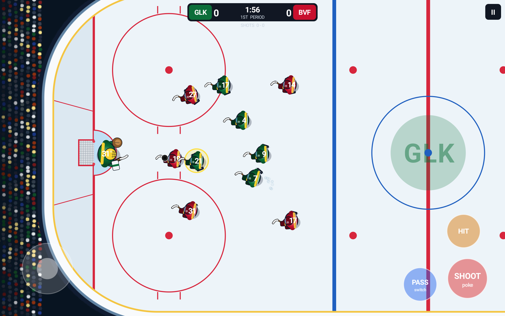

# Power Play Hockey

NHL-style 5-on-5 arcade ice hockey built for Amazon Fire tablets (and any other Android device). Touch controls, a full AI opponent with a real goalie, three periods with sudden-death overtime, and two-tablet local multiplayer over WiFi or Bluetooth.



## Features

- **5-on-5 hockey** — centre, wingers, defensemen and a goalie per side, with real rink geometry, faceoffs, offsides-free open play, and a broadcast-style camera that follows the puck.
- **Touch controls** — a floating joystick to skate, plus SHOOT (hold to charge, release to fire — or poke-check without the puck), PASS (aim with the stick, or switch to the nearest skater without the puck), and HIT (body check).
- **AI opponents** — three difficulty levels (Rookie, Pro, All-Star) with distinct skating speed, shot/pass accuracy, checking aggression, and goalie reflexes, plus rookie-friendly aim assist.
- **Full match flow** — three periods on the clock, faceoffs after every whistle, goalie freezes with a cover chance, sudden-death overtime, shots-on-goal tracking.
- **Two-tablet multiplayer** — host or join a match over local WiFi (mDNS discovery + a typed IP fallback) or classic Bluetooth (paired devices or a live scan), with client-side prediction so play stays smooth over the network.
- **Original audio** — every sound effect and music track is synthesized from scratch in Python (see [`tools/make_sounds.py`](tools/make_sounds.py)): crowd noise, board hits, whistles, an air horn, an arena organ riff, and NES-style chiptune menu/gameplay music. Independent sound-effect and music volume sliders.
- **Team roster** — 20 Calgary-area Timbits U7 clubs plus 8 fictional pro clubs, each with its own colours and jersey.
- **How to Play screen** — an in-app diagram of the controls for new players.

## Requirements

- Android Studio (or just a JDK 17+ and the Android SDK) with API 34 installed.
- minSdk 26 / targetSdk 34.
- A physical device or emulator in **landscape**; the game is locked to landscape.

## Building

```bash
./gradlew assembleDebug
```

The debug APK lands at `app/build/outputs/apk/debug/app-debug.apk`. Install it with:

```bash
adb install -r app/build/outputs/apk/debug/app-debug.apk
```

On a device with multiple user profiles (e.g. Fire OS with a kids profile), install and launch for a specific profile with `--user 0` / `am start --user 0 ...`.

## Regenerating audio

All sound effects and music are generated, not sampled — nothing here is copied from any commercial game. To change a sound or track, edit [`tools/make_sounds.py`](tools/make_sounds.py) and re-run it:

```bash
python tools/make_sounds.py
```

This rewrites every `.wav` file under `app/src/main/res/raw`. Requires `numpy` and `scipy`.

## Project layout

```
app/src/main/java/com/tablehockey/game/
├── MainActivity / MatchSettingsActivity / HowToPlayActivity / WifiLobbyActivity / GameActivity
├── model/       — TeamInfo (club roster), MatchConfig, Prefs (audio settings)
├── game/        — the engine: Rink geometry, World/Team/Skater/Puck state,
│                  Simulation (match flow, physics-adjacent rules), AIController,
│                  PhysicsEngine, Renderer + Camera, TouchControls, GameView,
│                  SoundManager / MusicManager
└── network/     — HostLink/GuestLink transport interfaces, NetCodec (wire
                   protocol), GameServer/GameClient (WiFi), BluetoothLink
                   (Bluetooth RFCOMM), NetworkSession
```

See [`CLAUDE.md`](CLAUDE.md) for a more detailed developer-oriented map of the codebase, build environment notes, and known quirks.

## Controls

- **Skate** — touch and drag anywhere on the left half of the screen.
- **Shoot** — hold to wind up, release to fire; push the stick up/down while shooting to aim for a corner. Without the puck, it pokes at the puck carrier.
- **Pass** — sends the puck to the teammate you're pointing at. Without the puck, switches control to the skater nearest the puck.
- **Hit** — lunges into a body check to knock the puck loose.

## License

All rights reserved. This is a personal project; no license is currently granted for reuse.
